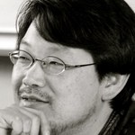
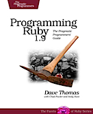

!SLIDE bullets incremental small transition=slideY
# Matz - 1993 #
*  
* Tornar as coisas simples **fáceis** e as coisas complexas **possíveis**
* A felicidade do programador em primeiro lugar

!SLIDE bullets incremental small transition=slideY
# Prag Dave - 2000 #
*  
* Chegada ao ocidente
* Primeiro livro em inglês
* RubyConf

!SLIDE bullets incremental small transition=slideY
# David Heinemeier Hansson - 2004 #
*  
* Rails
* Popularização
* Motivo dessa palestra
